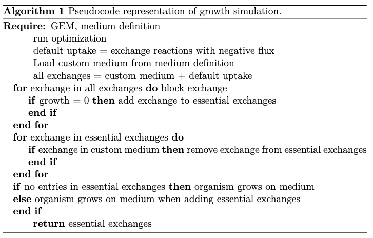

Ideas behind some implementations
=================================

Below you will find some arguing behind the implementation choices we made.

Growth simulation
-----------------

Growth rates and thus doubling times can be determined with Flux Balance Analysis (FBA). RefineGEMs uses a COBRApy based implementation that adds metabolites one-by-one to custom media definitions until growth is obtained. The pseudocode is shown below.

There is a flag called basis which can be set to either default_uptake or minimal_uptake. You can decide from which uptake you want to fill your medium of interest when looking for missing metabolites. Either the default_uptake which is the uptake that the model has when no specific medium is set or the minimal_uptake which is the uptake resulting from cobrapys minimal_medium optimization.