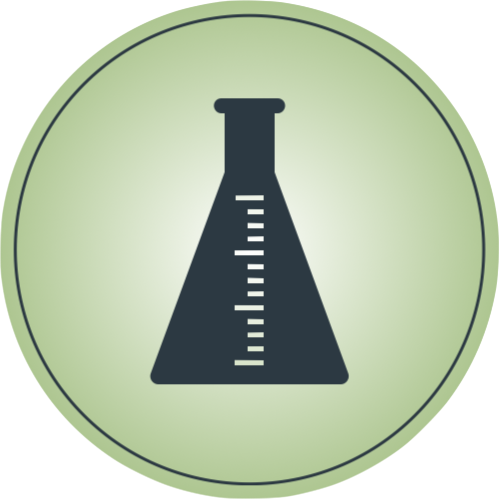

Welcome to refineGEMs!
======================================
``refineGEMs`` is a Python-based toolbox for the curation and analysis of genome-scale metabolic models (GEMS).

Overview
--------

This documentation provides information on how to install the toolbox, how to use it - either via 
command line or code - and provides different examples of use cases. Furthermore, it provides detailed 
information about the in-build media database and the code behind the modules.

Quick access to main sites
^^^^^^^^^^^^^^^^^^^^^^^^^^

.. raw:: html

  

.. raw:: html

  

.. raw:: html

  

.. raw:: html

  

Connections to other tools
^^^^^^^^^^^^^^^^^^^^^^^^^^
``refineGEMs`` also provides access points for other tools:

* Reporting the `MEMOTE <https://memote.readthedocs.io/en/latest/index.html>`__ score or generating a complete MEMOTE report
* Updating the SBO-Term annotations based on `SBOannotator <https://github.com/draeger-lab/SBOannotator>`__\ :footcite:p:`Leonidou2023_sboann`
* Balancing the masses and charges with `MassChargeCuration (MCC) <https://github.com/Biomathsys/MassChargeCuration>`__\ :footcite:p:`Finnem2023_mcc`
* Correcting a biomass objective function with `BOFdat <https://github.com/jclachance/BOFdat>`__

How to cite
-----------

When using ``refineGEMs``, please cite the latest publication:

  Famke Bäuerle, Gwendolyn O. Döbel, Laura Camus, Simon Heilbronner, and Andreas Dräger.
  Genome-scale metabolic models consistently predict in vitro characteristics of Corynebacterium
  striatum. Front. Bioinform., oct 2023. `doi:10.3389/fbinf.2023.1214074 <https://doi.org/10.3389/fbinf.2023.1214074>`__.

.. toctree::
   :maxdepth: 2
   :caption: Contents:

   installation
   usage
   main-modules
   database/intro
   Content of refineGEMs <api>
   Help and FAQ <help>
   Notes for developers <development>

.. footbibliography::
