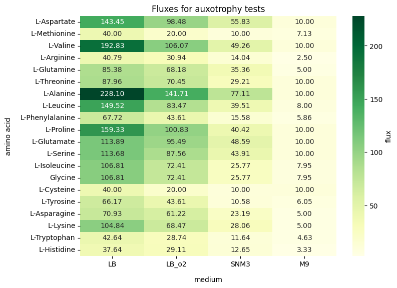
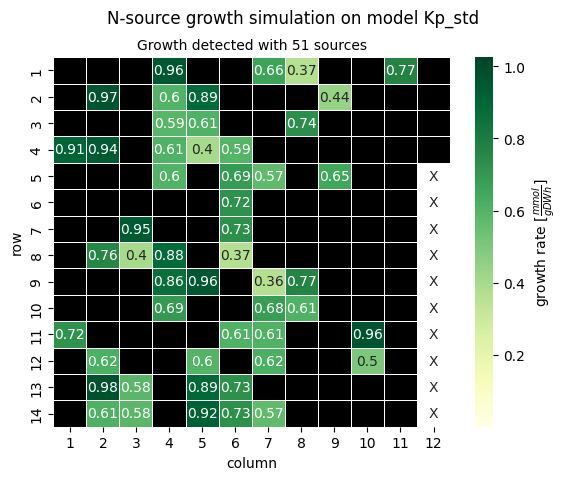

Growth simulation with refineGEMs
=================================

The :py:mod:`~refinegems.analysis.growth` submodule provides a number of functionalities
to analyse and simulate the growth of a model including:

1. Actual growth simulation on different media
2. Auxotrophy simulation
3. Simulating growth on different elemental sources, e.g. a C-source test
4. Modelling the minimal medium for a model

Growth 
------

Using :py:func:`~refinegems.analysis.growth.growth_analysis`, the growth between any number of models and media can be simulated.
For easier use, the media can be described using a ``config_media.yaml`` file, which can be used as input for the function.
The media configuration file allows for many kinds of manipulation of the media from the in-build database, 
as well as adding additional media from external sources to the list of media to be tested.

.. hint::

  - More information about the media configuration file can be found under :ref:`The media yaml file`.
  - More information about the in-build media can be found under :ref:`Media & Subsets`.

Furthermore, a supplementation mode can be set to ensure the model grows on the given medium.
Supplemented compounds are reported at the end to ensure complete transparency.

.. note::

  Currently implemented supplementation modes (in addition to none) include:

  - std/standard: Supplementation based on standard, non-zero flux medium compounds
  - min/minimal: Supplementation from the minimal medium the model is able to grow on

The function returns the report, plot or both depending on the input for ``retrieve``.
The report contains the growth value and doubling times, supplemented compounds and 
compounds for which no exchange reactions were found in the model. The report also provides 
functions for further visualisation of these values, including a tabulary and graphical display.

Auxothrophy 
-----------

The function :py:func:`~refinegems.analysis.growth.test_auxotrophies` tests the auxotrophies
for the 20 proteinogenic amino acids for a model, a set of media and supplement modes.

Iteratively for each amino acid the following steps are performed:

1. A sink reaction for the particular amino acid is temporarily added to the model.
2. The sink reaction is set as the model objective.
3. In case the model has an exchange reaction for this particular amino acid, this reaction is disabled to ensure, the only possible way for the model to have the amino acid is by producing it itself.
4. The model is optimised and the objective value for the added sink reaction is reported.
5. A value higher than the growth threshold signifies the ability of the model to produce the corresponding amino acid by itself. The model is auxotroph for the amino acid.

The function returns a report, which in turn can be e.g. visualised as a heatmap.

..
  @TODO What to do with the (...)?

Below, an examplary heatmap based on the Master Thesis of Carolin Brune (...) for 
*Klebsiella pneumoniae* MD01 can be seen. The model is able to produce all amino acids 
and therefore is autotroph for all amino acids.

Source test
-----------

Using the :py:func:`~refinegems.analysis.growth.test_growth_with_source` function,
the user can simulate the growth of a model on a medium while varying the source of a given
element, e.g. carbon. Using the parameter ``substances``, alternative sources can be set.
If none are given, the program tests for all available sources in the in-build database for the given element.

Iteratively, the function changes all metabolites containing the given element with the next in the list.
The model is optimised and the objective value for the BOF ist returned for all the different compounds.

.. important::

  For sensible test results, the starting medium should provide all other elements necessary
  for the growth of the model as other compounds. Only under these conditions can the results of the 
  source test safely be discussed in the context of changing a single source only.

Below you can see the examplary results for a *Klebsiella pneumoniae* model with a supplemented M9 medium.
The supplemented M9 medium contains all trace elements the bacterium needs to grow e.g. iron and a single 
nitrogen source that is swapped out during the test. Since the original nitrogen source was ammonia, swapping 
it out does not eliminate another element from the medium. The information, which cell contains which source, is saved in 
a seperate table to ensure good readability of the graphic.

Minimal medium
--------------

Using :py:func:`~refinegems.analysis.growth.model_minimal_medium`, a minimal medium (composition)
can be calculated.

Since the description of a minimal medium can vary, refineGEMs provides different 
ways to calculate one. This can be set using the parameter ``objective``:

- ``flux``: Find the minimal fluxes for the current medium 
- ``medium``: Find the minimal number of compounds based on the current medium
- ``exchanges``: Find the minimal number of compounds for a medium based on the exchange reactions in the model

.. note:: 

  The function always returns a single solution, but there may be more than one solution, especially
  for the third case.
