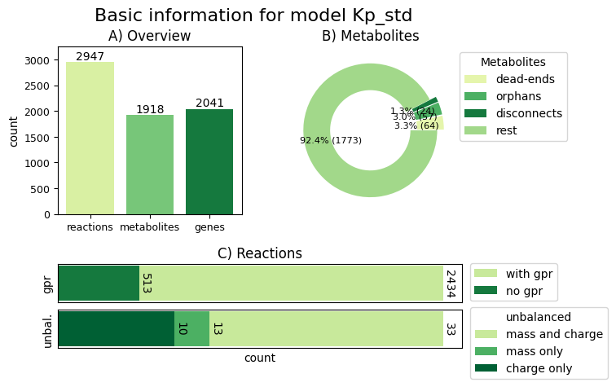

Statistical Report
==================

To compare or analyse a model after curation, some kind of statistis can be very handy.
One idea is to analyse the model with memote, however, the report consists - while being every detailed -
purely of numerical values. Additionally, if running it multiple times is required, it can be quite time consuming.

refineGEMs provides a quick and gaphic alternative in form of the :py:class:`~refinegems.classes.reports.ModelInfoReport` class.
It can produce a report on the main (statistic) properties of a model, including:

- the basic counts of reactions, metabolites and genes
- counts of the types of metabolites in the model
- number of reactions with and without GPRs
- number and types of unbalanced reactions

Furthermore, these values can be visualised as bar and donut chart.

.. note::

    We are currently working a extension of this class that directly produces a report that compares multiple models 
    instead of just one.

How to create the ModelInfoReport
---------------------------------

via command line
^^^^^^^^^^^^^^^^

The basic command is:

.. code-block:: bash

    refinegems analyse stats MODELPATH

Additionally, the path to the output directory can be added using the flag ``--dir/-d``
and the colours of the plot can be changes by passing a valid matplotlib colour palette 
abbreviation to ``--colors/-c``.

inside Python 
^^^^^^^^^^^^^

Assuming a model variable ``model`` that contains a ``cobra.Model`` entity, the 
report can be generated as follows:

.. code-block:: python

    report = ModelInfoReport(model)

    fig = report.visualise() # produces the graphic

    # dir : Path to output directory
    report.save(dir) # save the report (graphic + table)

Examplary ModelInfoReport visualisation
---------------------------------------

An exemplary visualisation of a report on the *Klebsiella pneumoniae* model generated in the Master Thesis of Carolin Brune
is shown below.

The visualisation contains three subfigures, one for the overview (upper left corner),
on for further statistics about the metabolites (upper right) and one for more information 
about the reactions in the model (bottom). The colours are the default colour palette ``YlGn``.

