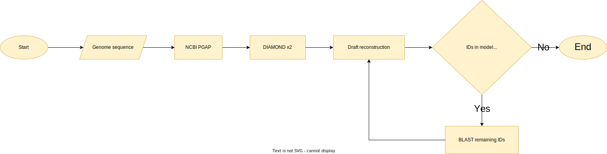

Pipeline: From genome sequence to draft model
=============================================

.. warning:: 
    | *Will be deprecated from version 2.0.0 onwards.*
    | The idea for this workflow has been incorporated into `SPECIMEN <https://github.com/draeger-lab/SPECIMEN>`__ under the name PGAB (PGAP-based) workflow.
    | Beware that SPECIMEN only runs with refineGEMs 2.0.0 (starting with developmental versions).

Generating a model for an organism where no information on genes and proteins is obtainable via any database 
causes the problem that the model will not contain valid database identifiers for any GeneProduct. To resolve this issue the 
workflow in Figure :numref:`workflow` can be used.

1. First annotate the genome with NCBI's Prokaryotic Genome Annotation Pipeline (PGAP) to obtain the same FASTA format as used in NCBI and use the flag for taxonomy checking.
2. Then use DIAMOND with the ``nr`` database from NCBI and the obtained annotated FASTA file as input. Restrict the search to your organism's taxon if known.
3. Check if any protein in the annotation FASTA file still has no database identifier.

    | -> YES: Rerun DIAMOND without the taxonomy check and without the restriction for the organism's taxon.
    |
    | -> NO: Continue with step 4.

4. Add the DIAMOND result to the annotated FASTA file.
5. Run e.g. ``CarveMe`` to obtain a draft model.
6. Check if in the model any GeneProducts without NCBI Protein or RefSeq identifiers occur.

    | -> YES: 
    |     i. Use individual BLAST searches for the remaining GeneProducts.
    |     ii. Add the results to the annotated and refined FASTA file.
    |     iii. Create again a draft model with the same program with the newly refined FASTA file.
    | 
    | -> NO: The draft model is done.

.. _workflow:

  Workflow from genome sequence to a draft model
